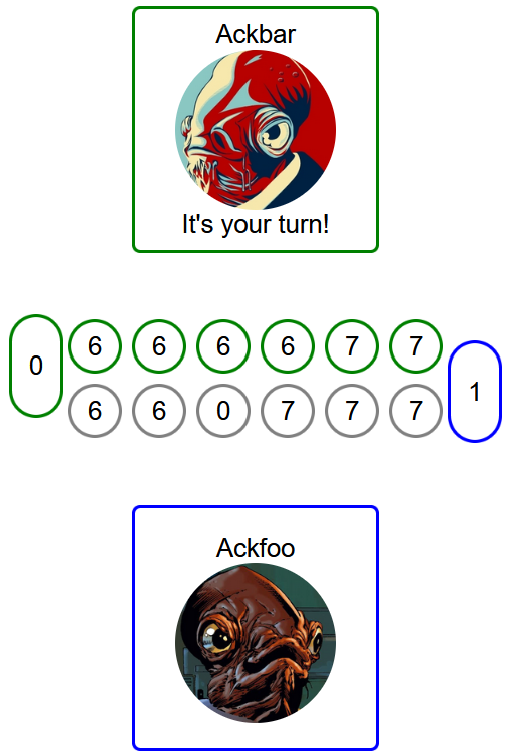
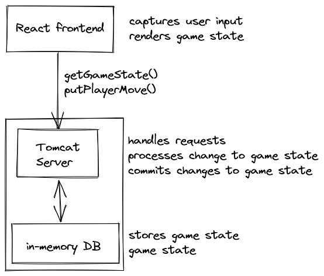

# Mancalamari

> **[WARNING!]** This project is a test assignment for bol.com. **_It is not actively maintained!_**


 
A digitized version of a turn-based, 2-player, seed-and-pit strategy game.

- https://boardgamearena.com/gamepanel?game=kalah
- https://en.wikipedia.org/wiki/Kalah
- https://en.wikipedia.org/wiki/Mancala

## Resources

 - Assignment brief: [TechAssignment_2021.pdf](./TechAssignment_2021.pdf)
 - GitLab repository: https://gitlab.com/bolcom/emerick-bosch

## Development

### How do I build and run the project?

#### Using Docker

This is meant to be the primary way to test the service. Ensure that Docker is installed on your system.

Build:

```sh
docker build -t xpcoffee/mancalamari . 
```

Run:

```sh
docker run -p 8080:8080 xpcoffee/producer
```

#### Directly using java

If you cannot use Docker, this section will guide you through some local modifications needed to run the service directly.

**NOTE:** You will need to have a Java runtime (v11+) installed on your system.

1. Build the project
```sh
./gradlew build
```
1. Run the resulting JAR
```sh
java -jar ./build/libs/emerick-bosch-1.0.0.jar
```

### How is the project structured?

See [STRUCTURE.md](./STRUCTURE.md)

### Where can I start picking up work?

See [TODO.md](./TODO.md)

## Design/architecture

### Tech choices

- HTTP - this is a turn-based game. We can keep things simple and avoid multi-threads, a persistent game loop and constant data-streaming by sticking with HTTP.
- RPC - actions taken by players are individual instructions. This maps well onto RPC-style calls.
- SpringBoot - this is a popular Java microservice application framework which runs Tomcat by default. It should reduce the boiler-plate needed to handle traffic.
- React - this is a popular JavaScript frontend tech. It also maps well to having a central state which is mutated on by actions to produce the next state.
- In memory DB (H2) - This was chosen to keep the persistence layer simple. There's no need for a long-lasting/resilient/recoverable/distributed data-store for this assignment.


